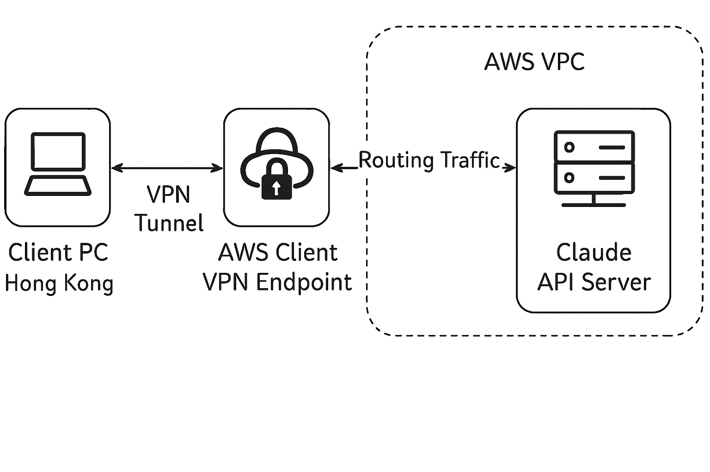

# AWS VPN Tunnel for Cluade AI

## Purpose
This project aims to set up a secure VPN tunnel using AWS Client VPN to bypass regional geo-restrictions for accessing AI services like Claude AI from Hong Kong. By routing internet traffic through an AWS Virtual Private Cloud (VPC) in a non-restricted region (e.g., US East), the device's IP address appears to originate from that region, allowing access to services blocked in Hong Kong. The objective is to provide a managed, scalable solution without self-hosting servers, ensuring encrypted connections for privacy and compliance with AWS best practices.

## Diagram

Above is a component diagram illustrating the components and connection flow. It shows how the client PC in Hong Kong connects to the Claude API server via the AWS VPN tunnel.

### Component Description

| Component                     | Description                                                             |
| ----------------------------- | ----------------------------------------------------------------------- |
| Client PC                     | Device in Hong Kong running the OpenVPN client.                |
| AWS Client VPN Endpoint       | Managed VPN server handling connections.                         |
| ACM (AWS Certificate Manager) | Provides certificates for secure authentication.                    |
| AWS VPC                       | Virtual network in a non-restricted region with subnets and routing. |
| Claude API Server             | The target service that enforces geo-blocks based on incoming IP.   |

### Principle
The core principle relies on point-to-site VPN tunneling, where the local device establishes a secure, encrypted connection to an AWS-managed VPN endpoint. This routes all or selected traffic through the VPN, masking the original IP with one from the AWS region. 

For geo-restricted services like Claude AI, requests appear to come from an allowed location (e.g. US), bypassing blocks based on IP geolocation. Key benefits include mutual authentication via certificates, automatic scaling, and integration with AWS services for monitoring and logging. Traffic is encrypted end-to-end, preventing interception, and split-tunneling can be disabled to force all traffic through the tunnel for complete IP obfuscation.

## Procedures
### Step 1: Prepare AWS Resources
Log in to the AWS Management Console and select a non-restricted region (e.g., us-east-1).

Create a VPC with at least two subnets (public and private) and attach an Internet Gateway for outbound access.

### Step 2: Set Up Certificates
In AWS Certificate Manager (ACM), request a private server certificate and generate a client certificate.

Import certificates for mutual authentication.

### Step 3: Create Client VPN Endpoint
Navigate to VPC > Client VPN Endpoints > Create.

Configure with a unique Client CIDR (e.g., 172.16.0.0/22), mutual authentication using ACM certificates, and disable split-tunneling for full traffic routing.

Associate with the VPC subnets and add authorization rules (e.g., 0.0.0.0/0 for all traffic).

### Step 4: Configure Routing and Security
Update route tables to direct 0.0.0.0/0 to the Internet Gateway. Set security groups to allow UDP ports 1194 or 443 for VPN traffic.

### Step 5: Connect from Client PC
Download the .ovpn configuration file from the VPN endpoint. Install OpenVPN client on the PC, import the file, and connect using the client certificate.

Verify the connection and test access to Claude AI.

### Step 6: Test and Monitor
Access Claude; the IP should now be from the AWS region. Use CloudWatch for logging and monitoring connections