# AWS VPN Tunnel for Cluade AI

## Purpose

This project aims to set up a secure VPN tunnel to AWS Client VPN to bypass regional geo-restrictions for accessing AI services like Claude AI from Hong Kong. By routing internet traffic through an AWS Virtual Private Cloud (VPC) or services like (Lightsail) in my case in a non-restricted region (e.g., US East), the device's IP address appears to originate from that region, allowing access to services blocked in Hong Kong. The objective is to provide a managed, scalable solution without self-hosting servers, ensuring encrypted connections for privacy and compliance with AWS best practices.

So why not building a VPN connection? That's a very inspirative question, the main reason for me is to **selectively** pick my desired URL to use VPN, for the sake of efficiency and connection performance installing a general VPN or subscribing a VPN service cannot help.

## Prerequisites

This project and some commands are tested on Windows 11, but it should work on other OS as well provided that corresponding tools are installed.

1. AWS lightsail instance
2. SSH client (e.g., autossh, SSHTunnel)
3. Docker (for hosting PAC file)
4. PAC file (for proxy configuration)
5. Windows 11 (for proxy settings)
6. Chrome extension (optional)

## Diagram

```mermaid
graph TD
    subgraph "💻 User's Device (in Hong Kong)"
        direction LR
        Browser["Browser / App"]
        PAC["PAC File / Proxy Config"]
        SSHClient["SSH Client (e.g., autossh, SSHTunnel)"]

        Browser -- "1\. Request to claude.ai" --> PAC;
        PAC -- "2\. Domain Match: Route to Proxy" --> SSHClient;
        Browser -- "B. Request to other sites (e.g., google.com)" --> PAC;
        PAC -- "C. No Match: Connect DIRECT" --> Internet;
    end

    subgraph "☁️ AWS Cloud (in Korea Region)"
        direction LR
        Lightsail["Lightsail Instance (Proxy Server)"]
    end

    SSHClient -- "3\. Encrypted SSH Tunnel over Internet" --> Lightsail;
    Internet([🌐 Internet]);
    Lightsail -- "4\. Decrypted request forwarded" --> Claude;
    Claude(["🤖 Geo-restricted Service (e.g.:claude.ai)"]);
    OtherService(["✅ Other Websites (google.com)"]);
    Internet --> OtherService;

    %% Style definitions
    style Browser fill:#fff,stroke:#333,stroke-width:2px
    style PAC fill:#e6f3ff,stroke:#0066cc,stroke-width:2px
    style SSHClient fill:#ffe6e6,stroke:#cc0000,stroke-width:2px
    style Lightsail fill:#ffebcc,stroke:#ff9900,stroke-width:2px
```



Above is a component diagram illustrating the components and connection flow. It shows how the client PC in Hong Kong connects to the geographically limited services like Claude API server via the AWS VPN tunnel.

### Component Description

| Component                     | Description                                                             |
| ----------------------------- | ----------------------------------------------------------------------- |
| Client PC                     | Device in Hong Kong running the OpenVPN client.                |
| AWS Lightsail Endpoint       | Managed VPN server handling connections.                         |
| PAC File | Proxy Auto-Configuration file defining proxy settings for specific domains. To be loaded in browser or Windows network settings.                   |
| Geo-Restricted Service            | The target service that enforces geo-blocks based on incoming IP. (e.g. Claude AI)   |

### Principle

The core principle relies on point-to-site VPN tunneling, where the local device establishes a secure, encrypted connection to an AWS-managed lightsail server endpoint. This routes all or selected traffic through the VPN, masking the original IP with one from the AWS region. 

For geo-restricted services like Claude AI, requests appear to come from an allowed location (e.g. US), bypassing blocks based on IP geolocation. Key benefits include mutual authentication via certificates, automatic scaling, and integration with AWS services for monitoring and logging. Traffic is encrypted end-to-end, preventing interception, and split-tunneling can be disabled to force all traffic through the tunnel for complete IP obfuscation.

## Procedures

### Step 1: Prepare AWS resources

Log in to the AWS Management Console and select a non-restricted region (e.g., us-east-1).

Navigate to Lightsail and create a new instance in the selected region. Start the server

### Step 2: Setup the Lightsail instance

Simply choose an instance with the location which is not blocked by the target website. E.g. South Korea in our case. After the instance (Ubuntu in our case) boot up, setup the static ip address bound to the instance and get the .pem file for SSH connection through "Connect" tab in the lightsail panel for later non password required connection.

### Step 3: Create and initialize the SSH SOCKS proxy

Assume the lightsail instance is up and running, and you have ssh client installed in your local machine, you can use the following command to create the SSH tunnel.

```bash
ssh -i /path/to/your/lightsail-key.pem -N -D 1080 lightsail-username@your-lightsail-ip-address
```

This command essentially creates a SOCKS5 proxy on your local machine that forwards traffic to the Lightsail instance. The `-D 1080` option specifies the local port to listen on for the SOCKS proxy. When there are connections coming in on this port, they are forwarded to the remote server (Lightsail instance) through the SSH tunnel.

You can replace the ip address with the domain name if you have configured the DNS.

### Step 4: Prepare the PAC File and host it as local docker container (nginx)

The PAC file is used to define proxy settings for specific domains which is our main purpose. Sample file is provided in this repository. We can control which domains to use the proxy or use the direct connection by editing the file.

After editing the PAC file, we can host it as a local docker container using nginx using the below command.

```bash
docker run -it --rm -d -p 8080:80 -v "C:/aws-vpn-tunnnel-for-claude-ai/proxy.pac:/usr/share/nginx/html/proxy.pac" --name PAC nginx
```

The command above will host the PAC file on port 8080, configure Windows network settings to use the PAC file by pointing to `http://127.0.0.1:8080/proxy.pac` as shown in the screenshot below.


Navigate to geo-restricted services like Claude AI and verify that you can access them.

## Step 5: Automate the process (optional)

The above steps are automated by the `Start-VPNTunnel.ps1` script. You can run the script to start the VPN tunnel. Refer to below for more details.

Before running the script, you need to rename `config.sample.ini` to `config.ini` and edit the `config.ini` file to configure the SSH connection and PAC file path. After that, you can run the script to start the VPN tunnel.

```powershell
.\Start-VPNTunnel.ps1
```

The script will check if the SSH tunnel and PAC file hosting container are running, and start them if not. It will also configure the Windows network settings to use the PAC file.

## Troubleshooting

During the setup, I encounter different issues, here are some of them to note.

1. After setting up the SOCKS proxy, I added the proxy IP to the Windows 11 network settings, but the proxy is not working. Seems like the "Proxy IP Address" field will not read properly if only IP address is filled, you have to add `socks=` before the IP address to make it work. (refer to the screenshot below)

**Note: Chrome plugin mentioned above is not required if you are using this method.** <br><br>

2. After setting up the proxy, I found that it only works on HTTP protocol like surfing the website through browser, for services not using HTTP like Claude Code, it does not work. <br><br>

3. Windows's Network Settings > Proxy > Use Setup Script is not accepting the local file path, it has to be a HTTP URL. I never think that `file:///` is not accepted, thus I have to host the PAC file locally using docker.

## References

- [Socks5 Configurator](https://chromewebstore.google.com/detail/socks5-configurator/hnpgnjkeaobghpjjhaiemlahikgmnghb) - Chrome extension to configure proxy settings for specific domains. It is an alternative to editing the PAC file and adding proxy settings to Windows network settings.
- [Setting SOCKS proxy on Windows](https://superuser.com/questions/1528185/how-can-i-set-socks-proxy-on-windows)
- [Tackling Proxy: How to use Proxy Auto-Config (PAC) on Windows 11](https://medium.com/@gireeshagmt/tackling-proxy-how-to-use-proxy-auto-config-pac-on-windows-11-e9a6fa585918)